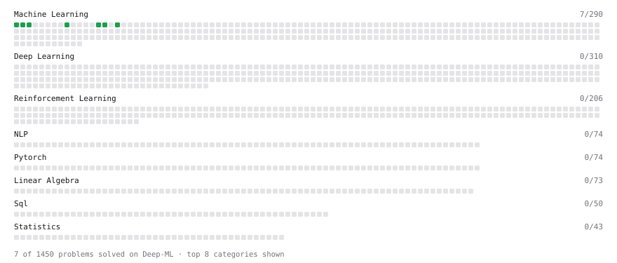

# Deep-ML

My machine learning practice from [Deep-ML](https://www.deep-ml.com). Every solution here was written by hand.

**11** solved · 11 problems · 0 labs · 0 math

[**Browse the interactive portfolio**](https://Ashish11828.github.io/deep-ml/) to replay this filling in over time.

## Problems

| | Difficulty | Solved | |
| --- | --- | --- | --- |
| [Calculate Accuracy Score](https://www.deep-ml.com/problems/36) | easy | 2025-07-18 | [solution](problems/0036-calculate-accuracy-score) |
| [Feature Scaling Implementation](https://www.deep-ml.com/problems/16) | easy | 2025-07-18 | [solution](problems/0016-feature-scaling-implementation) |
| [Implement F-Score Calculation for Binary Classification](https://www.deep-ml.com/problems/61) | easy | 2025-07-19 | [solution](problems/0061-implement-f-score-calculation-for-binary-classification) |
| [Implement Precision Metric](https://www.deep-ml.com/problems/46) | easy | 2025-07-19 | [solution](problems/0046-implement-precision-metric) |
| [Implement Recall Metric in Binary Classification](https://www.deep-ml.com/problems/52) | easy | 2025-07-19 | [solution](problems/0052-implement-recall-metric-in-binary-classification) |
| [Implement Ridge Regression Loss Function](https://www.deep-ml.com/problems/43) | easy | 2025-07-18 | [solution](problems/0043-implement-ridge-regression-loss-function) |
| [Linear Kernel Function](https://www.deep-ml.com/problems/45) | easy | 2025-07-19 | [solution](problems/0045-linear-kernel-function) |
| [Linear Regression Using Gradient Descent](https://www.deep-ml.com/problems/15) | easy | 2025-07-18 | [solution](problems/0015-linear-regression-using-gradient-descent) |
| [Linear Regression Using Normal Equation](https://www.deep-ml.com/problems/14) | easy | 2025-07-18 | [solution](problems/0014-linear-regression-using-normal-equation) |
| [One-Hot Encoding of Nominal Values](https://www.deep-ml.com/problems/34) | easy | 2025-07-18 | [solution](problems/0034-one-hot-encoding-of-nominal-values) |
| [Random Shuffle of Dataset](https://www.deep-ml.com/problems/29) | easy | 2025-07-18 | [solution](problems/0029-random-shuffle-of-dataset) |

---

_This file is regenerated by Deep-ML on every push._
